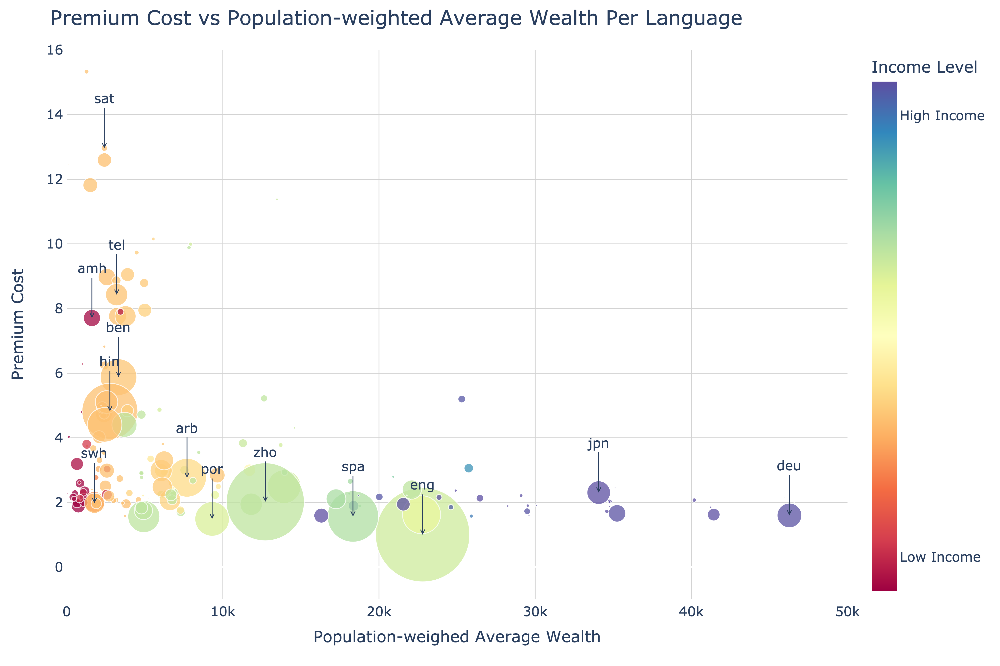

# Double Jeopardy and Climate Impact in the Use of Large Language Models: Socio-economic Disparities and Reduced Utility for Non-English Speakers

This work investigates the socio-economic disparities and reduced utility for non-English speakers in the use of large language models (LLMs). We use the FLORES-200 dataset and Ethnologue to analyze the socio-economic disparities in the use of LLMs. We also use the OpenAI's GPT-4 API to assess the reduced utility of LLMsfor non-English speakers.

<br>
<p align="center">

</p>
<br>
<p align="center">

</p>
<p align="center">
<strong>Double Jeopardy and Climate Impact in the Use of Large Language Models: Socio-economic Disparities and Reduced Utility for Non-English Speakers</strong>
<br>
<a href="https://arxiv.org/abs/2410.10665">Paper on ArXiv</a>
</p>
<br>

## Data sources and APIs

This section provides an overview of the datasets and APIs used in the paper.

- [FLORES-200 and FLORES+](https://github.com/facebookresearch/flores): A multilingual dataset covering 100 languages, with 1,000 sentences per language. Used for evaluating translation quality and computing the tokenization premium relative to English.
- [Ethnologue](https://www.ethnologue.com/): Provides linguistic data, including the number of speakers, geographic distribution, and writing systems. We use Ethnologue to estimate the number of speakers for each language.
- [World Development Indicators (WDI)](https://datacatalog.worldbank.org/dataset/world-development-indicators): Contains socio-economic data at the country level. Specifically, we use the GDP per capita in current US\$ (NY.GDP.PCAP.CD) and the annual population growth rates (SP.POP.GROW) indicators to compute the population-weighted GDP for each language and for aligning population estimates to 2022 based on historical figures from Ethnologue.
- [OpenAI GPT-4o and GTP-4 Turbo APIs](https://openai.com/api/): Used to assess the reduced utility of LLMs for non-English speakers. We applied translation with different prompting methods to generate reference translations for FLORES sentences. The LLM translated non-English sentences into English, with the original English sentences serving as a benchmark for evaluating translation quality.

## Notebooks

This section provides a listing and brief description of the notebooks used to generate inputs for the paper.

- [`notebooks/`](notebooks/): This folder contains the notebooks used to generate the data and analyze the results.
  - [`notebooks/compute-premium-costs.ipynb`](notebooks/compute-premium-costs.ipynb): Computes the tokenization premium for the FLORES dataset. The calculation of the population-weighted GDP for each language is also done in this notebook.
  - [`notebooks/back-translation-task.ipynb`](notebooks/back-translation-task.ipynb): Generates the back-translation task for the FLORES dataset. The notebook implements the batched translation strategy for the translation task and uses the OpenAI GPT-4o API.
  - [`notebooks/analysis.ipynb`](notebooks/analysis.ipynb): Notebook for additional analysis of the results. Key visualizations are generated in this notebook, including the comparison of the tokenization premiums between two different tokenizers (GPT-4o vs. GPT-4 Turbo).

Also, in the [`reports/`](reports/) folder, you can find the figures generated for the paper.

## Running the code

This repository uses poetry to manage dependencies. To install the dependencies, run the following command:

```bash
poetry install
```

To review the list of dependencies, please refer to the [`pyproject.toml`](pyproject.toml) file.

VS Code / Cursor users can use the [Python extension](https://code.visualstudio.com/docs/python/python-tutorial) to run the notebooks.

Otherwise, use the following command to spin up a local Jupyter server:

```bash
poetry run jupyter notebook
```

It is recommended to use a virtual environment to run the code.

Additionaly, the `notebooks/compute-premium-costs.ipynb` notebook uses the OpenAI API. To use the API, you need to set the `OPENAI_API_KEY` environment variable. You can create a `.env` file in the root of the repository and add the following:

```
OPENAI_API_KEY=<your-openai-api-key>
```

## Computational resources

This work has been developed using a MacBook Pro with an M1 Pro processor and 64GB of RAM. No GPU is needed for the computations. Access to the OpenAI API is required.

## Notes

Some of the notebooks are not publically available because they are used to handle proprietary data from Ethnologue which is not publicly available. One of the notebooks is used to compute the adjusted population based on the historical figures from Ethnologue and the annual population growth rates.

## Citation

Please cite our paper as follows when referencing this work.

``` bibtex
@misc{solatorio2024doublejeopardyclimateimpact,
      title={Double Jeopardy and Climate Impact in the Use of Large Language Models: Socio-economic Disparities and Reduced Utility for Non-English Speakers},
      author={Aivin V. Solatorio and Gabriel Stefanini Vicente and Holly Krambeck and Olivier Dupriez},
      year={2024},
      eprint={2410.10665},
      archivePrefix={arXiv},
      primaryClass={cs.CL},
      url={https://arxiv.org/abs/2410.10665},
}
```

## Code of Conduct

The <span style="color:#3EACAD">template</span> maintains a [Code of Conduct](docs/CODE_OF_CONDUCT.md) to ensure an inclusive and respectful environment for everyone. Please adhere to it in all interactions within our community.

## License

The <span style="color:#3EACAD">template</span> is licensed under the [**Mozilla Public License**](https://www.mozilla.org/en-US/MPL). Remember to replace the [license](LICENSE) if necessary. If open source, [choose an open source license](https://choosealicense.com).

