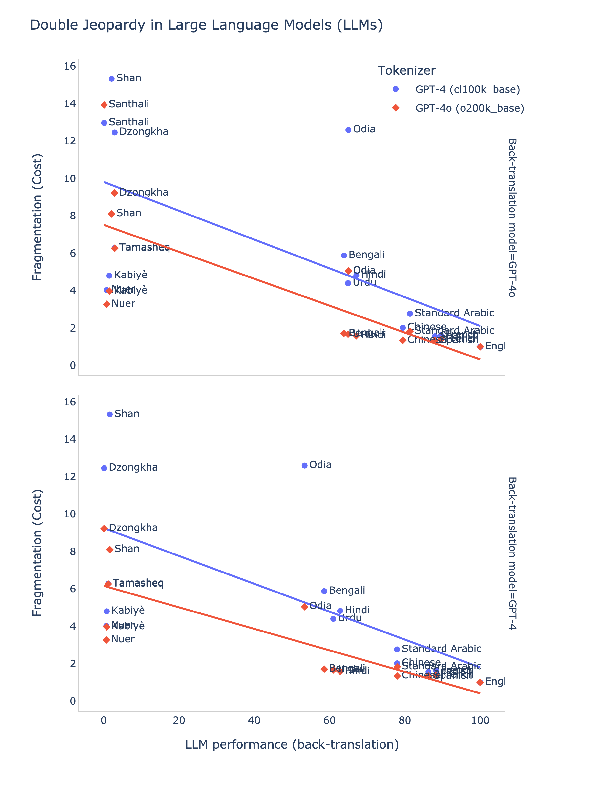

# Double Jeopardy and Climate Impact in the Use of Large Language Models: Socio-economic Disparities and Reduced Utility for Non-English Speakers

This work investigates the socio-economic disparities and reduced utility for non-English speakers in the use of large language models (LLMs). We use the FLORES-200 dataset and Ethnologue to analyze the socio-economic disparities in the use of LLMs. We also use the OpenAI's GPT-4 API to assess the reduced utility of LLMsfor non-English speakers.

 
 

<strong>Double Jeopardy and Climate Impact in the Use of Large Language Models: Socio-economic Disparities and Reduced Utility for Non-English Speakers</strong>
 
<a href="https://arxiv.org/abs/2410.10665">Paper on ArXiv</a>

 

## Code of Conduct

The template maintains a [Code of Conduct](docs/CODE_OF_CONDUCT.md) to ensure an inclusive and respectful environment for everyone. Please adhere to it in all interactions within our community.

## License

The template is licensed under the [**Mozilla Public License**](https://www.mozilla.org/en-US/MPL). Remember to replace the [license](LICENSE) if necessary. If open source, [choose an open source license](https://choosealicense.com).
